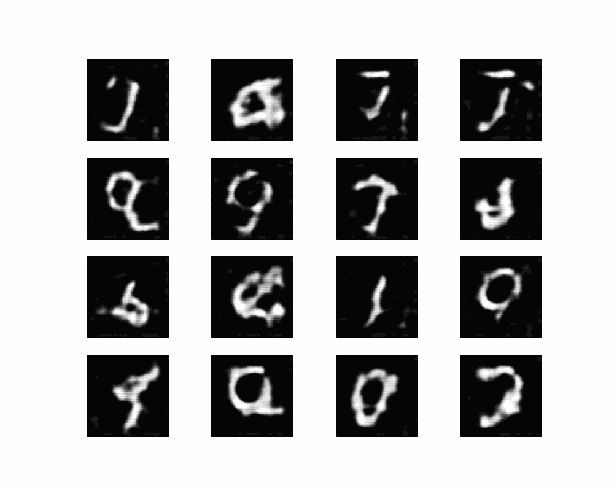

# DCGAN

Original paper: [Unsupervised Representation Learning with Deep Convolutional Generative Adversarial Networks](https://arxiv.org/abs/1511.06434)

DCGAN is a GAN that uses convolutional neural networks and is designed especially for images.

- Both the generator and discriminator are CNNs
- The architecture is fully convolutional (no fully connected layers)
- Convolutions and transposed convolutions are

Here the training is done on MNIST dataset.

## Results
This shows the evolution of samples generated from a fixed noise vector across epochs.

